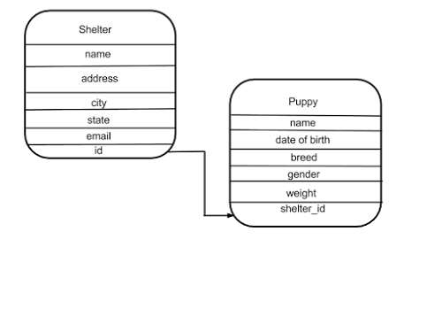

# Exercise 1 - Setting Up the Database

I have drawn up the following layout for my database. Go ahead and create a python file to model this database layout or create one of your own. In the next exercise I will provide you some code to help populate this database. This code should create a SQLite file called puppies.db in your working directory. Refer to the database_setup.py file you created for reference.



You’ve already seen the Integer and String column properties used in the restaurant menu database, check out the SQLAlchemy documentation to view some of the other properties you can use to define your column attributes: http://docs.sqlalchemy.org/en/latest/core/type_basics.html

```
Resposta: ver ex01_db_setup.py
```

# Exercise 2 - Database Population and Queries

Download and run puppypopulator.py file to populate your database with puppies and shelters. If you have a database layout different from the one I provided, you may have to modify puppypopulations.py in order for the code to properly function.

Using SQLAlchemy perform the following queries on your database:

1 . Query all of the puppies and return the results in ascending alphabetical order

```
Resposta: ex02_queryAllThePuppies.py
```

2 . Query all of the puppies that are less than 6 months old organized by the youngest first

```
Resposta: ex02_query6MonthsOldPuppies.py
```

3 . Query all puppies by ascending weight

```
Resposta: ex02_queryPuppiesByWeight.py
```

4 . Query all puppies grouped by the shelter in which they are staying

```
Resposta: ex02_queryPuppiesGroupByShelter.py
```

# Exercise 3 - Associations

Many to One Associations

Up until now, the only relationship between tables we have used have been one-to-many. Each restaurant menu belonged to one restaurant and each puppy belongs to one shelter. We will now discuss and implement one-to-one and many-to-many tert all tabs to spaceable associations two puppies

One to One Associations

One-to-one associations indicate that one row in a table is allowed to have a foreign key relationship with one and only one row in another table. In this exercise you will create puppy profiles to collect even more information about each puppy. Each puppy is allowed one profile which can contain a url to the puppy’s photo, a description about the puppy, and any special needs the puppy may have. Implement this table and the foreign key relationship in your code.

```
Resposta: ex03_oneToOne.py
```

Many to Many Associations

Puppies can be adopted by one person, or a family of people. Similarly, a person or family can adopt one or several puppies. See if you can create a many-to-many relationship between puppies and adopters.

```
# Segui o exemplo de http://pythoncentral.io/sqlalchemy-association-tables/
Resposta: ex03_manyToMany.py
```

# Exercise 4 - Adding Shelter Capacities

We now want to add a column to our shelter database to specify the maximum_capacity each shelter can have for puppies, also add a current_occupancy for finding the current number of puppies that haven’t yet been adopted that are living in the shelter. Add the maximum_capacity and current_occupancy columns to your database.

```
Resposta: ex04_addShelterCapacity
```

# Exercise 5 - Shelter Overflow Algorithm

Create a function to check a puppy into a shelter, if the shelter is at capacity, prompt the user to try a different shelter. If you’re feeling extra ambitious write an algorithm that will find another shelter in the same area or with a higher vacancy. If all shelters are full, prompt the user that a new shelter needs to be opened.

```
Resposta: ex05_shelterOverflow.py
```

# Where Do I Start?

Check out the SQLAlchemy documentation on relationships. http://docs.sqlalchemy.org/en/latest/orm/relationships.html

Database Migrations

Currently, each time you want to modify your database, you end up having to delete the old database and create a new one, losing all the data. For these small exercises where we can just run a population script that is fine, but what if the data cannot be recreated easily? You may be forced to write export and import scripts yourself. Luckily, we have a much better option. Both SQLAlchemy-migrate and Flask-migrate can keep track of database updates for us. For the problem set we will not go in depth on database migrations, but if you are interested you can learn how to implement them reading the articles below:
https://sqlalchemy-migrate.readthedocs.org/en/latest/

https://flask-migrate.readthedocs.org/en/latest/ (Note: you will learn how to build a web application with the Flask microframework in Lesson 3)
